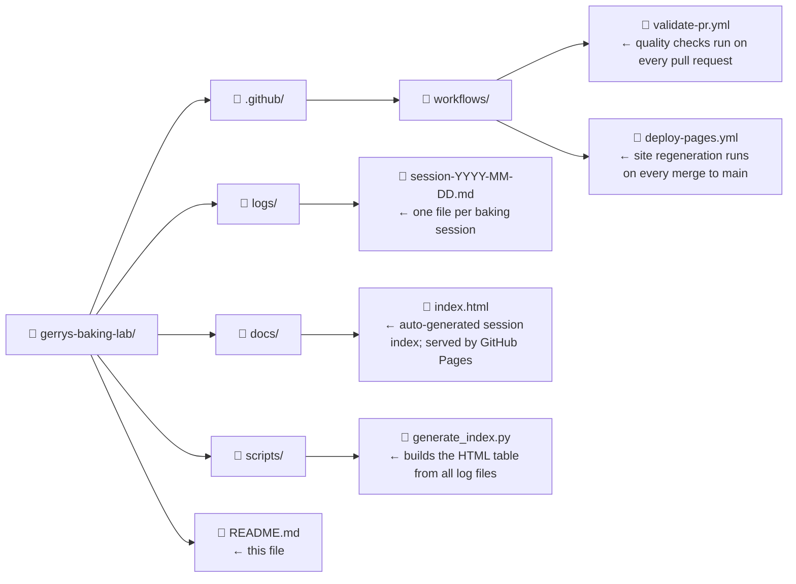

# 🍪 Gerry's Baking Lab

A scientific record of chocolate chip cookie experiments.

---

## What is this?

Every experiment deserves a lab notebook. This repository is a **digital baking log** — a structured, version-controlled record of every chocolate chip cookie session run at Gerry's Baking Lab.

Each session tests a specific hypothesis: a new ingredient, a changed technique, or a combination of interventions derived from previous results. Results are recorded honestly — including failures — and conclusions carry forward into future experiments.

---

## Log format

Session logs live in the `logs/` folder, one file per experiment, named by date:

```
logs/session-YYYY-MM-DD.md
```

Every log starts with a YAML frontmatter block that captures the key parameters:

```yaml
---
session_id: "2026-06-10-001"
date: "2026-06-10"
baker: "Baker Name"
hypothesis: "One sentence describing what you expect and why"
temperature: "375°F / 190°C"
duration: "11 minutes"
---
```

Below the frontmatter, each log contains four sections:

- **Ingredients** — full recipe with quantities
- **Procedure** — step-by-step method, including any deviations
- **Observed Results** — objective measurements and sensory notes
- **Conclusions** — whether the hypothesis was confirmed, and what carries forward

See `logs/session-2026-05-28.md` for a fully worked example with a multi-variable combined intervention.

---

## Session index

A summary of all sessions is published as a live table at:

```
https://gerryatitesm.github.io/gerrys-baking-lab/
```

The table is regenerated automatically whenever a new session is merged.

---

## Repository structure



---

## Contributing a session

Contributions of new baking sessions are welcome. To submit one:

1. Fork this repository and clone your fork.
2. Create a new file in `logs/` following the naming convention and format described above.
3. Commit with a message in this format: `log: <short description>`
4. Push and open a Pull Request against this repository.

Automated checks will verify your file's structure before the PR can be merged.

Added this to check something..